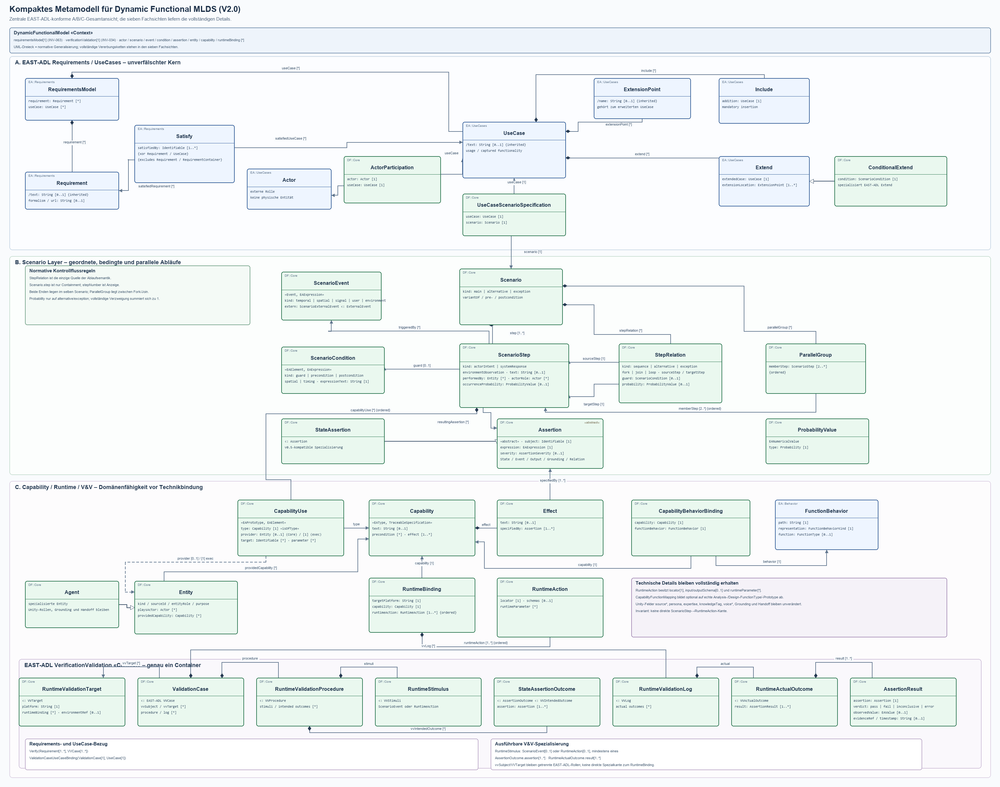

# Anonymous FunctionalMLDS review repository

This is the anonymized repository for reviewing the FunctionalMLDS metamodel,
generation pipeline, example cases, and runtime integration.

## Start here

1. Read the [generated metamodel specification](output/metamodel_v2/generated/dynamic_functional_mlds_v2_specification.md).
2. Open the [metamodel overview](output/metamodel_v2/generated/dynamic_functional_mlds_v2_metamodel.svg).
3. Inspect the three examples under [`output/case_studies/`](output/case_studies/).
4. Run the [artifact verifier](research/iui2027/artifact/README.md).

## Metamodel

The canonical, machine-readable definition is
[`tools/dynamic_functional_mlds_v2_model.py`](tools/dynamic_functional_mlds_v2_model.py).
It defines the packages, datatypes, classes, associations, invariants, views, and
compatibility contract. The complete generated representation is under
[`output/metamodel_v2/generated/`](output/metamodel_v2/generated/):

- [model JSON](output/metamodel_v2/generated/dynamic_functional_mlds_v2.model.json)
- [written specification](output/metamodel_v2/generated/dynamic_functional_mlds_v2_specification.md)
- overview as [SVG](output/metamodel_v2/generated/dynamic_functional_mlds_v2_metamodel.svg),
  [PNG](output/metamodel_v2/generated/dynamic_functional_mlds_v2_metamodel.png), or
  [Mermaid source](output/metamodel_v2/generated/dynamic_functional_mlds_v2_metamodel.mmd)
- [deterministic generation manifest](output/metamodel_v2/generated/generation_manifest.sha256.json)



### Diagram views

| View | PNG | SVG | Mermaid |
| --- | --- | --- | --- |
| EAST-ADL infrastructure | [image](output/metamodel_v2/generated/01_east_adl_infrastructure.png) | [vector](output/metamodel_v2/generated/01_east_adl_infrastructure.svg) | [source](output/metamodel_v2/generated/01_east_adl_infrastructure.mmd) |
| Requirements and use cases | [image](output/metamodel_v2/generated/02_east_adl_requirements_usecases.png) | [vector](output/metamodel_v2/generated/02_east_adl_requirements_usecases.svg) | [source](output/metamodel_v2/generated/02_east_adl_requirements_usecases.mmd) |
| Function, system, and behavior | [image](output/metamodel_v2/generated/03_east_adl_function_system_behavior.png) | [vector](output/metamodel_v2/generated/03_east_adl_function_system_behavior.svg) | [source](output/metamodel_v2/generated/03_east_adl_function_system_behavior.mmd) |
| FunctionalMLDS scenario flow | [image](output/metamodel_v2/generated/04_dfmlds_scenario_flow.png) | [vector](output/metamodel_v2/generated/04_dfmlds_scenario_flow.svg) | [source](output/metamodel_v2/generated/04_dfmlds_scenario_flow.mmd) |
| Capability and runtime mapping | [image](output/metamodel_v2/generated/05_dfmlds_capability_runtime.png) | [vector](output/metamodel_v2/generated/05_dfmlds_capability_runtime.svg) | [source](output/metamodel_v2/generated/05_dfmlds_capability_runtime.mmd) |
| Verification and validation | [image](output/metamodel_v2/generated/06_east_adl_dfmlds_verification_validation.png) | [vector](output/metamodel_v2/generated/06_east_adl_dfmlds_verification_validation.svg) | [source](output/metamodel_v2/generated/06_east_adl_dfmlds_verification_validation.mmd) |
| Optional annex, feature, and knowledge packages | [image](output/metamodel_v2/generated/07_optional_annex_feature_knowledge.png) | [vector](output/metamodel_v2/generated/07_optional_annex_feature_knowledge.svg) | [source](output/metamodel_v2/generated/07_optional_annex_feature_knowledge.mmd) |

## Repository map

| Path | Contents |
| --- | --- |
| `output/metamodel_v2/generated/` | Complete generated V2 metamodel, specification, diagrams, and hashes |
| `output/case_studies/` | Three synthetic example cases with v0.5 and V2 instances |
| `tools/case_study_pipeline/` | FunctionalMLDS generation and validation pipeline |
| `tools/tests/` | Artifact, regeneration, benchmark, and materialization tests |
| `research/iui2027/artifact/` | Reproduction instructions and complete verifier |
| `research/iui2027/evaluation/` | Benchmark runner, results, tables, and source hashes |
| `InteractivAgents/openai_unity_expert_npcs_pycharm/InteractiveAgents/` | Python runtime components |
| `InteractivAgents/InteractiveAgents2/` | Minimal Unity runtime and editor integration |

## Reproduce and verify

From the repository root:

```text
python -m pip install -r research/iui2027/artifact/requirements.txt
python tools/generate_dynamic_functional_mlds_v2.py
python research/iui2027/artifact/verify.py
```

The generator recreates the 27 metamodel artifacts. The verifier checks their
manifest hashes, canonical model equivalence, diagram geometry, case regeneration,
benchmark, runtime materialization, Unity source contracts, and anonymous-release
hygiene.
